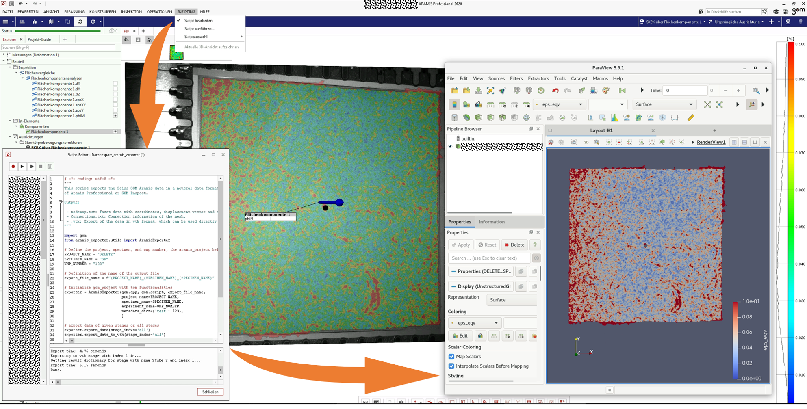

# Data exporter for Zeiss GOM Inspect/ARAMIS Professional


[](https://doi.org/10.5281/zenodo.11092746)


The data exporter is a third-party Python package that enables the export of 3D digital image correlation
(DIC) data from a [Zeiss GOM Inspect/ARAMIS Professional](https://www.gom.com/en/products/3d-testing/aramis-3d-camera)
project in a neutral and human-readable ASCII data format. The export contains the mesh, displacement and
strain data, as well as metadata. This provides high flexibility for further processing using open source software.
The package has been designed for usage within the Python environment of the Zeiss GOM Inspect/ARAMIS Professional 
software. It has minimal dependencies and is straightforward to install.

The outputs are as follows:

- *nodemap.txt*: A combined table of metadata and the nodes with their coordinates, displacement, strain data.
- *connections.txt*: A list of all elements and their connecting codes of the triangular mesh.
- *nodemap.vtk*: A file readable for Visualization Toolkit (VTK), which contains both nodal data and mesh data in a standardised ASCII data format.

This enables the data to be read by [CrackPy](https://github.com/dlr-wf/crackpy), a Python package for the analysis of
crack propagation based on DIC data. CrackPy offers a wide range of methods for reading,
processing and plotting the data. Furthermore, the VTK file can be imported into [ParaView](https://www.paraview.org/)
for visualization.



## Table of Contents

1. [Installation](#installation)
2. [Usage](#usage)
3. [ARAMIS project preparation](#aramis-project-preparation)
4. [Nodemap](#nodemap)
5. [Connections](#connections)
6. [VTK](#vtk)
7. [Dependencies](#dependencies)
8. [License](#license)
9. [Intellectual Property and Authorship](#intellectual-property-and-authorship)

## Installation

### Install the ARAMIS Exporter

To install the package, ensure you have administrative rights, then run in a Windows command prompt:

```bash
cd "C:\Program Files\GOM\2020\python\"
python.exe -m pip install --upgrade git+https://github.com/dlr-wf/aramis-data-exporter.git
```

### Install in development mode

For development purposes, you can also clone the package, which allows you to make changes without reinstalling.

1. Clone the repository:

```bash
git clone https://github.com/dlr-wf/aramis-data-exporter.git "C:\OurPythonLibraries"
```

2. Navigate to the package directory:

```bash
cd "C:\OurPythonLibraries\aramis_exporter"
```

3. Install in development mode:

```bash
"C:\Program Files\GOM\2020\python\python.exe" setup.py develop
```

4. To uninstall the package, run:

```bash
"C:\Program Files\GOM\2020\python\python.exe" setup.py develop --uninstall
```


## Usage

The package can be used in the Python environment of Zeiss GOM Inspect/ARAMIS Professional. The following code snippet
shows how to use the package:

```python
import gom
from aramis_exporter.utils import AramisExporter

# Define the project name, specimen name and experiment name
PROJECT_NAME = "DELETE"
SPECIMEN_NAME = "SP"
WMP_NUMBER = "123"

# Definition of the name of the output file
export_file_name = f"{PROJECT_NAME}_{SPECIMEN_NAME}_{SPECIMEN_NAME}"

# Initialize gom_project with tom functionalities
exporter = AramisExporter(gom,
                          export_file_name,
                          project_name=PROJECT_NAME,
                          specimen_name=SPECIMEN_NAME,
                          experiment_name=WMP_NUMBER,
                          metadata_dict={'test': 123})
# export data of given stages or all stages
exporter.export_data(stage_indxs='all')
# export data to vtk
exporter.export_data_to_vtk(stage_indxs='all')
```

## ARAMIS project preparation

The initialization of the `AramisExporter` class prepares the GOM project as follows:

1. Checks if all necessary data are calculated, otherwise create and compute `surface_component` for $u_{x}$,
   $u_{y}$, $u_{z}$, $\varepsilon_{x}$, $\varepsilon_{y}$, 
   $\varepsilon_{xy}$, $\varepsilon_{\mathrm{eqv}}$.
2. Checks if rigid body motion compensation (RBMC) was conducted and is active. If this is not the case, the RBMC is
   performed.
3. Gathers all process data from the open ARAMIS DIC project like process data, calibration data, facet size,
   facet distance, analog input, value elements, sensor setup, etc.
4. Create output folder and export data for all stages to individual files.

## Nodemap

The nodemap file stores the nodal or facet data. Metadata or comments can be stored in the header, identified by the
symbol `#`. The data section includes individual columns containing nodal coordinates, displacement vector, and strain
tensor defined for plane strain conditions.

```plaintext
# Process data:
# specimen                      : Dummy2
####################################################################################################
# SIGNALS:
# force                         : value_element       : 14985.6119156
# displacement                  : value_element       : -9.17953395844
#
# force_analog                  : analog_input        : 15102.5390625
# displacement_analog           : analog_input        : -7.6751708984375

####################################################################################################
#        ID;         x_undef [mm];         y_undef [mm];         z_undef [mm];               u [mm];               v [mm];               w [mm];             epsx [%];             epsy [%];            epsxy [1];           epseqv [%]
         1;       -80.0564567626;        84.9779203814;         0.1509636527;    0.003655774286017;    0.059203740209341;   -0.158300071954727;   -0.185958549380302;   -0.112336091697216;   -0.000613267708104;    0.310294896364212
         2;       -79.2904753387;        85.0053386055;         0.1975326408;    0.001983210910112;    0.060109287500381;   -0.155325025320053;   -0.209498479962349;   -0.005866464227438;   -0.000913561263587;    0.267783910036087
```

Here:

- `ID` is the node number.
- `x_undef`, `y_undef`, `z_undef` are the nodal coordinates in the undeformed reference coordinate system, given in
  millimeters.
- `u`, `v`, `w` are the displacements in x, y and z direction, given in millimeters.
- `epsx`, `epsy`, `epsxy` are the components of the Cauchy's strain tensor. **Note that `epsx` and `epsy` are given in %, while `epsxy` is given without a ratio!**
- `epseqv` is the equivalent von Mises strain and is optional and can be computed in CrackPy as well later on.
- The separator is a semicolon `;`

## Connections

The connection file defines the relationships between nodes within the elements of the triangular mesh. 
Each row in the file represents a single triangular element and specifies which nodes are connected to form that 
triangle. The connection data is formatted as follows:


```plaintext
      Type;  Element #;     Node 1;     Node 2;     Node 3
          3;          1;        108;          1;          0
          3;          2;        109;          2;          1
          3;          3;        110;          3;          2
```

## VTK

The Visualization Toolkit (VTK) provides file formats for storing mesh data in a standardized and neutral format. 
It can be used in many post-processing tools. We use
the [VTK legacy](https://docs.vtk.org/en/latest/design_documents/VTKFileFormats.html#simple-legacy-formats)
format. The VTK files can subsequently be imported into, e.g., [ParaView](https://www.paraview.org/) for visualization. Further options to
read and process the data in Python are [pyvista](https://docs.pyvista.org/) (`pip install pyvista`)
and [vtk](https://vtk.org/) (`pip install vtk`).

The following scalars are available:

- `x [mm]`, `y [mm]`, `z [mm]`
- `u_x [mm]`, `u_y [mm]`, `u_z [mm]`
- `eps_x [%]`, `eps_y [%]`, `eps_xy [1]`, `eps_vm [%]`

## Export directory structure

The export process creates the following directory structure:

- `export_directory`
  - `nodemap_subfolder`: Contains the nodemap files for each stage.
  - `connection_subfolder`: Contains the connection files for each stage.
  - `vtk_subfolder`: Contains the VTK files for each stage (if VTK export is performed).

## Dependencies

- [Zeiss GOM Inspect/ARAMIS Professional](https://www.gom.com/de-de/produkte/3d-testing/aramis-3d-camera) (Version > 2020)
- [numpy](https://numpy.org/) (This should already be part of the Python environment in Zeiss Gom Inspect/Aramis)
- [gom](https://www.gom.com/de-de/services/gom-training/gom-skripting) (Internal Zeiss Gom Inspect/ARAMIS Python
  package)

## License

The package is developed for research only and must not be used for any production or specification purposes.
The package is under current development and all functionalities are on a prototype level.
Feel free to use the code, however, we do not guarantee in any form for its flawless implementation and execution.
However, if you run into errors in the code or find any bugs, we will be happy if you contact us.
Licensed under MIT License (see LICENSE file)

## Intellectual Property and Authorship

**Authors**\
Tobias Strohmann\
David Melching\
Eric Breitbarth ([eric.breitbarth@dlr.de](mailto:eric.breitbarth@dlr.de))
